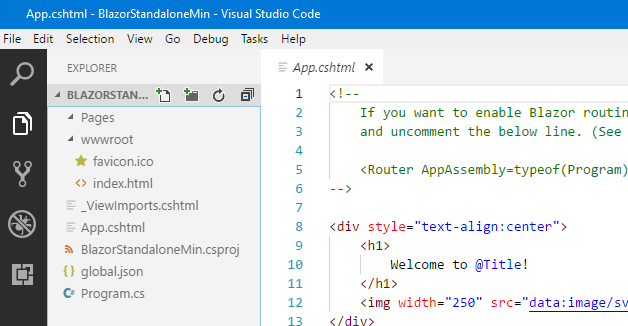
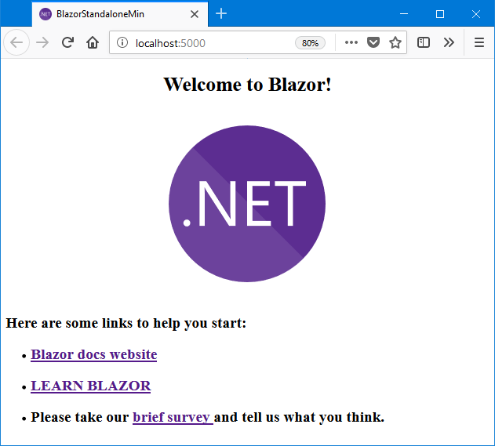

# Blazor Minimum Project Templates [](https://www.nuget.org/packages/Toolbelt.AspNetCore.Blazor.Minimum.Templates/)

## Summary

This is project templates package for ASP.NET Core **"Blazor"** without JavaScript and CSS libraries, designed for dotnet CLI.

> Blazor is an experimental .NET web framework using **C#** and HTML that **runs in the browser**. [Learn More...](https://blazor.net/)

The Blazor application project, which is created by this template, contains only the minimum necessary files, like this.



When you run this project, the following page will be displayed in a web browser.



## System requirement

- [.NET Core 2.1 SDK](https://www.microsoft.com/net/download) (2.1.500 or later)

## How to install

```shell
> dotnet new -i Toolbelt.AspNetCore.Blazor.Minimum.Templates
```

## How to use

If you want to create a new Blazor application project which standalone edition, type `dotnet new` command with a short name of the template "**blazormin**".

```shell
> dotnet new blazormin
```

If you want a ASP.NET Core hosted edition, use a short name of the template "**blazorhostedmin**".

```shell
> dotnet new blazorhostedmin
```

These commands are create a new project in current directory, and the project name is same as the current directory name.

See also: ["dotnet new command - .NET Core CLI" | Microsoft Docs](https://docs.microsoft.com/en-us/dotnet/core/tools/dotnet-new?tabs=netcore21)

## License

[The Unlicense](LICENSE)
